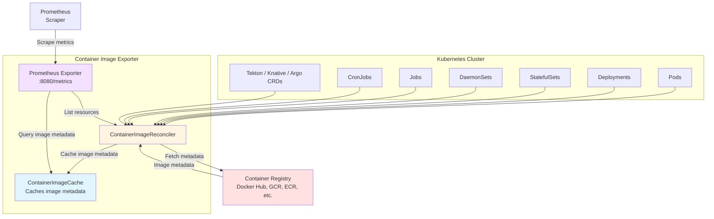

# container-image-exporter

Exports Prometheus metrics about container images in a Kubernetes cluster.



## Installation

Presently, you will need to build the image yourself.

```
export IMAGE_REF=your.registry/container-image-exporter:latest
docker build -t "${IMAGE_REF}" --push .
```

### Helm

Install using the Helm chart, passing your image repository and tag:

```
helm install container-image-exporter ./deploy/chart \
    --namespace container-image-exporter \
    --create-namespace \
    --set image.repository=your.registry/container-image-exporter \
    --set image.tag=latest
```

If you are using the [Prometheus Operator](https://github.com/prometheus-operator/prometheus-operator), enable the `ServiceMonitor` with:

```
--set serviceMonitor.enabled=true
```

### Static manifests

The default static configuration can be installed as follows.

```
curl https://raw.githubusercontent.com/chainguard-sandbox/container-image-exporter/refs/heads/main/deploy/manifests/container-image-exporter.yaml \
    | sed "s|IMAGE_REF|$IMAGE_REF|g" \
    | kubectl apply -f -
```

The service is annotated with these values, which are commonly used to discover
scrape targets in Kubernetes.

```
prometheus.io/scrape: "true"
prometheus.io/port: "8080"
prometheus.io/path: "/metrics"
```

If you are using the [Prometheus
Operator](https://github.com/prometheus-operator/prometheus-operator) you can
scrape the metrics with a `ServiceMonitor` like this.

```
apiVersion: monitoring.coreos.com/v1
kind: ServiceMonitor
metadata:
  name: container-image-exporter
spec:
  endpoints:
  - path: /metrics
    port: metrics
  namespaceSelector:
    matchNames:
    - container-image-exporter
  selector:
    matchLabels:
      app.kubernetes.io/name: container-image-exporter
```

## Metrics

| Metric                          | Description                                                                                            | Labels                                                         |
| ------------------------------- | ------------------------------------------------------------------------------------------------------ | -------------------------------------------------------------- |
| container_image_container_info  | Details about containers running in the cluster, including the image digest resolved by the exporter.  | group, version, kind, namespace, name, jsonpath, image, digest |
| container_image_annotation      | Annotations from the image manifest.                                                                   | digest, key, value                                             |
| container_image_label           | Labels from the image config.                                                                          | digest, key, value                                             |
| container_image_size_bytes      | The size of the image in the registry.                                                                 | digest                                                         |
| container_image_created         | The created date from the image config. Expressed as a Unix Epoch Time.                                | digest                                                         |

## Supported Resources

The exporter watches the following resource types and extracts container image
references from each.

### Built-in

| Group  | Resource      | Container paths                                                        |
| ------ | ------------- | ---------------------------------------------------------------------- |
| core   | Pod           | `spec.initContainers`, `spec.containers`, `spec.ephemeralContainers`   |
| apps   | Deployment    | `spec.template.spec.initContainers`, `spec.template.spec.containers`   |
| apps   | StatefulSet   | `spec.template.spec.initContainers`, `spec.template.spec.containers`   |
| apps   | DaemonSet     | `spec.template.spec.initContainers`, `spec.template.spec.containers`   |
| batch  | Job           | `spec.template.spec.initContainers`, `spec.template.spec.containers`   |
| batch  | CronJob       | `spec.jobTemplate.spec.template.spec.initContainers`, `spec.jobTemplate.spec.template.spec.containers` |

### CRDs (auto-discovered)

The following CRD types are watched automatically if they are installed in the
cluster. No configuration is required — the exporter queries the API server's
discovery endpoint at startup to detect which of these are available. 

However, you will need to give the exporter permissions to list the resources
(see below).


| Group                | Resource              | Container paths                                                                                    |
| -------------------- | --------------------- | -------------------------------------------------------------------------------------------------- |
| tekton.dev           | Task                  | `spec.steps`, `spec.sidecars`                                                                      |
| tekton.dev           | TaskRun               | `spec.taskSpec.steps`, `spec.taskSpec.sidecars`                                                    |
| serving.knative.dev  | Service               | `spec.template.spec.containers`, `spec.template.spec.initContainers`                               |
| serving.knative.dev  | Revision              | `spec.containers`, `spec.initContainers`                                                           |
| argoproj.io          | Workflow              | `spec.templates[*].container`, `spec.templates[*].script`, `spec.templates[*].initContainers`, `spec.templates[*].sidecars` |
| argoproj.io          | WorkflowTemplate      | `spec.templates[*].container`, `spec.templates[*].script`, `spec.templates[*].initContainers`, `spec.templates[*].sidecars` |
| argoproj.io          | ClusterWorkflowTemplate | `spec.templates[*].container`, `spec.templates[*].script`, `spec.templates[*].initContainers`, `spec.templates[*].sidecars` |
| argoproj.io          | CronWorkflow          | `spec.workflowSpec.templates[*].container`, `spec.workflowSpec.templates[*].script`, `spec.workflowSpec.templates[*].initContainers`, `spec.workflowSpec.templates[*].sidecars` |

### Permissions for CRDs

The example manifests only grant permissions for the built-in resource types.
If any of the CRDs above are installed in your cluster and you want the
exporter to watch them, you must extend the `ClusterRole` with additional
rules.

For example, to add Tekton and Argo Workflows support.

```yaml
- apiGroups: ["tekton.dev"]
  resources: ["tasks", "taskruns"]
  verbs: ["get", "list", "watch"]
- apiGroups: ["serving.knative.dev"]
  resources: ["services", "revisions"]
  verbs: ["get", "list", "watch"]
- apiGroups: ["argoproj.io"]
  resources: ["workflows", "workflowtemplates", "clusterworkflowtemplates", "cronworkflows"]
  verbs: ["get", "list", "watch"]
```

At startup the exporter performs a test `list` against each discovered CRD to
verify it has permission. If the list is denied, that resource type is silently
skipped and a message is logged. The exporter will continue to function
normally for all other resource types.

## Dashboards

See [dashboards](./dashboards) for examples of Grafana dashboards that consume
the exporter's metrics.


## Configuration

### Credentials

The exporter will attempt to fetch registry credentials from any pull secrets
configured for the target resources, in the same way that the kubelet would
when running a pod. If you don't want to grant the exporter permissions to
read secrets across the cluster, you can disable this behaviour with
`--k8s-keychain=false` and remove the references to secrets and service accounts
from the cluster role.

Additionally, it will use any available cloud-specific credentials that are
configured for the `container-image-exporter` pod when interacting with
Google Container Registry, Google Artifact Registry, AWS ECR or Azure
Container Registry.

You can also modify the contents of the
`container-image-exporter-docker-config` secret to add static credentials for
other registries.

### Cache Duration

To reduce the number of requests made to upstream registries, the exporter will
cache the response for each image for a configurable amount of time. The default
is 1 hour.

You can modify this duration with the `--cache-duration=6h` flag.

### Multi-Architecture Images

The exporter doesn't know the architecture of the node that a given container
spec will ultimately be deployed to. So, when it encounters a multi-architecture
image, it will resolve it to the `linux/amd64` image, or if that platform is
absent, the first image in the list.

In general, images in the same index share the same or very similar metadata,
so the metrics that are returned are typically still useful and representative,
even if they aren't taken from the image that will ultimately be deployed to a
node.

You can configure the exporter to default to a different platform with the
`--platform=linux/arm64` flag.

## Development

### Running the tests

The tests use [envtest](https://pkg.go.dev/sigs.k8s.io/controller-runtime/pkg/envtest)
to run a real Kubernetes API server and etcd in-process, and an in-process
container registry to push and pull images against. You do not need a running
Kubernetes cluster.

The `make test` target installs the required binaries via
[setup-envtest](https://pkg.go.dev/sigs.k8s.io/controller-runtime/tools/envtest/cmd/setup-envtest)
and then runs the suite.

```
make test
```

The binaries are cached in `./bin/` and only downloaded once. To install them
without running tests:

```
make envtest
```

## Example Queries

### Percentage of Containers Based on Chainguard

Unless they are specifically overwritten, Docker will persist the labels from
the base image in the images it builds. This means you can use those labels to
infer various things about the images defined in your clusters.

For instance, you could use the presence of the `dev.chainguard.package.main`
label to calculate the percentage of containers defined in the cluster that are
using Chainguard images or images based on Chainguard.

```
  (
      count(
        container_image_container_info{kind!="Pod"}
        * on (digest) group_left (value)
          container_image_label{key="dev.chainguard.package.main"}
      )
    /
      count(
        container_image_container_info{kind!="Pod"}
      )
  )
*
  100
```

This query excludes pods so that it is measuring the container specs that are
directly configured by the user (i.e Deployments, StatefulSets, CronJobs).

This is typically a better way to measure the number of 'applications that
still need to be migrated to Chainguard' than looking at the running
containers, which can be skewed by, for instance, Deployments or Daemonsets
that run 100s of pods versus a StatefulSet that runs a handful.

### Images Older Than X Number of Days

Frequently rebuilding your images from up to date base images is an effective
way to ensure you are incorporating CVE fixes.

You can use `container_image_created` to identify images that weren't built
recently.

For instance, this query returns series for images that were created more than
14 days ago.

```
    time()
  -
    (
        max by (digest, image) (container_image_container_info)
      * on (digest) group_left ()
        container_image_created
    )
>
  86400 * 14
```

It's worth noting that not all build tools will set the `created` timestamp when
they build an image.
