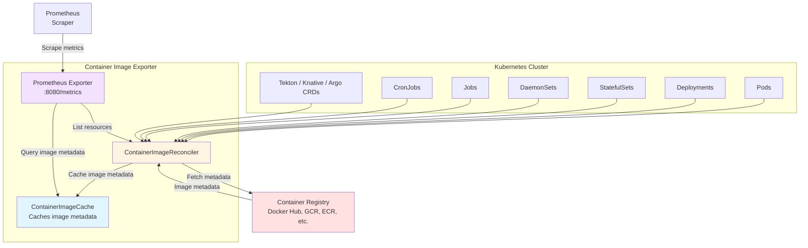
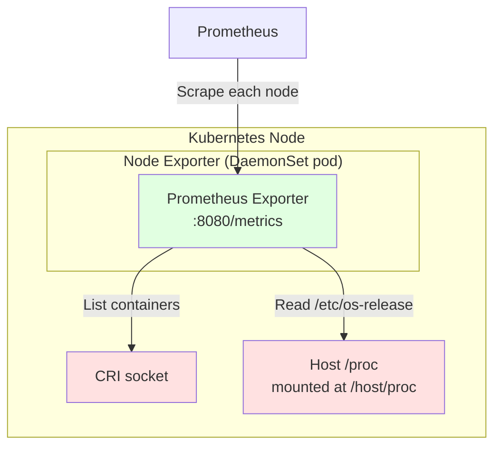
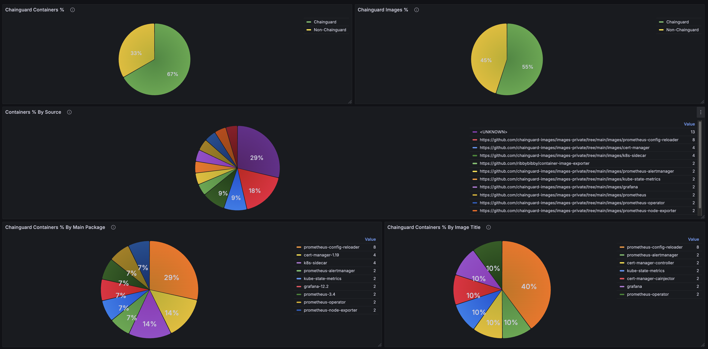

# container-image-exporter

> [!WARNING]
> This project is in the early stages of development and may not be suitable
> for production usage. Maintenance is provided on a best-effort basis.

Exports Prometheus metrics about container images in a Kubernetes cluster.

Particularly useful for tracking usage and adoption of Chainguard images across
a cluster based on image or container metadata.

## Components

The project consists of two components, each of which can be deployed
independently or together.

### Exporter

A cluster-wide Deployment that watches Kubernetes resources and fetches image
metadata from remote registries.

Doesn't require host-level access to containers.



### Node Exporter

A DaemonSet that runs on each node and exports OS release information for each
container.

The most reliable method for inferring whether a running container is
Chainguard-based, but it does need to be ran as root on the host.



## Installation

Build and push the image:

```
export IMAGE_REF=your.registry/container-image-exporter:latest
docker build -t "${IMAGE_REF}" --push .
```

### Helm

Install using the Helm chart, providing your image repository and tag:

```
helm install container-image-exporter ./deploy/chart \
    --namespace container-image-exporter \
    --create-namespace \
    --set image.repository=your.registry/container-image-exporter \
    --set image.tag=latest
```

Both components are enabled by default. To deploy only one of them:

```
# Disable the node-exporter Daemonset
--set nodeExporter.enabled=false

# Or, disable the exporter Deployment
--set exporter.enabled=false
```

If you are using the Prometheus Operator, enable the ServiceMonitors:

```
--set exporter.serviceMonitor.enabled=true \
--set nodeExporter.serviceMonitor.enabled=true
```

If you are using Grafana (via kube-prometheus-stack), enable automatic dashboard provisioning:

```
--set grafana.dashboards.enabled=true
```

### Manifests

Install the cluster-wide exporter:

```
curl https://raw.githubusercontent.com/chainguard-sandbox/container-image-exporter/refs/heads/main/deploy/manifests/exporter.yaml \
    | sed "s|IMAGE_REF|$IMAGE_REF|g" \
    | kubectl apply -f -
```

And/or the per-node DaemonSet:

```
curl https://raw.githubusercontent.com/chainguard-sandbox/container-image-exporter/refs/heads/main/deploy/manifests/node-exporter.yaml \
    | sed "s|IMAGE_REF|$IMAGE_REF|g" \
    | kubectl apply -f -
```

If you are using the [Prometheus
Operator](https://github.com/prometheus-operator/prometheus-operator), scrape
the components with a `ServiceMonitor`:

```yaml
apiVersion: monitoring.coreos.com/v1
kind: ServiceMonitor
metadata:
  name: container-image-exporter
spec:
  endpoints:
  - path: /metrics
    port: metrics
  namespaceSelector:
    matchNames:
    - container-image-exporter
  selector:
    matchLabels:
      app.kubernetes.io/name: container-image-exporter
---
apiVersion: monitoring.coreos.com/v1
kind: ServiceMonitor
metadata:
  name: container-image-node-exporter
spec:
  endpoints:
  - path: /metrics
    port: metrics
  namespaceSelector:
    matchNames:
    - container-image-exporter
  selector:
    matchLabels:
      app.kubernetes.io/name: container-image-node-exporter
```

Otherwise, both components annotate their Services for common Prometheus
auto-discovery:

```yaml
prometheus.io/scrape: "true"
prometheus.io/port: "8080"
prometheus.io/path: "/metrics"
```

## Metrics

### Exporter

| Metric                          | Description                                                                                            | Labels                                                         |
| ------------------------------- | ------------------------------------------------------------------------------------------------------ | -------------------------------------------------------------- |
| container_image_container_info  | Details about containers running in the cluster, including the image digest resolved by the exporter.  | group, version, kind, namespace, name, jsonpath, image, digest |
| container_image_annotation      | Annotations from the image manifest.                                                                   | digest, key, value                                             |
| container_image_label           | Labels from the image config.                                                                          | digest, key, value                                             |
| container_image_size_bytes      | The size of the image in the registry.                                                                 | digest                                                         |
| container_image_created         | The created date from the image config. Expressed as a Unix Epoch Time.                                | digest                                                         |
| container_image_up              | 1 if the last collection completed successfully (all resource types listed), 0 otherwise.              | —                                                              |

### Node Exporter

| Metric                               | Description                                                                                       | Labels                                                                                   |
| ------------------------------------ | ------------------------------------------------------------------------------------------------- | ---------------------------------------------------------------------------------------- |
| container_image_node_container_info  | Per-running-container info: identity (pod, namespace, image, image_id) and OS release fields read from /etc/os-release inside the container's rootfs. | id, namespace, pod, container, image, image_id, os_build_id, os_id, os_id_like, os_image_id, os_image_version, os_name, os_pretty_name, os_variant, os_variant_id, os_version, os_version_codename, os_version_id |
| container_image_node_exporter_up     | 1 if the last collection completed successfully, 0 otherwise.                                     | —                                                                                        |

## Supported Resources

The exporter watches the following resource types and extracts container image
references from each.

### Built-in

| Group  | Resource      | Container paths                                                        |
| ------ | ------------- | ---------------------------------------------------------------------- |
| core   | Pod           | `spec.initContainers`, `spec.containers`, `spec.ephemeralContainers`   |
| apps   | Deployment    | `spec.template.spec.initContainers`, `spec.template.spec.containers`   |
| apps   | StatefulSet   | `spec.template.spec.initContainers`, `spec.template.spec.containers`   |
| apps   | DaemonSet     | `spec.template.spec.initContainers`, `spec.template.spec.containers`   |
| batch  | Job           | `spec.template.spec.initContainers`, `spec.template.spec.containers`   |
| batch  | CronJob       | `spec.jobTemplate.spec.template.spec.initContainers`, `spec.jobTemplate.spec.template.spec.containers` |

### CRDs (auto-discovered)

The following CRD types are watched automatically if they are installed in the
cluster. No configuration is required — the exporter queries the API server's
discovery endpoint at startup to detect which of these are available.

However, you will need to give the exporter permissions to list the resources
(see below).

| Group                | Resource              | Container paths                                                                                    |
| -------------------- | --------------------- | -------------------------------------------------------------------------------------------------- |
| tekton.dev           | Task                  | `spec.steps`, `spec.sidecars`                                                                      |
| tekton.dev           | TaskRun               | `spec.taskSpec.steps`, `spec.taskSpec.sidecars`                                                    |
| serving.knative.dev  | Service               | `spec.template.spec.containers`, `spec.template.spec.initContainers`                               |
| serving.knative.dev  | Revision              | `spec.containers`, `spec.initContainers`                                                           |
| argoproj.io          | Workflow              | `spec.templates[*].container`, `spec.templates[*].script`, `spec.templates[*].initContainers`, `spec.templates[*].sidecars` |
| argoproj.io          | WorkflowTemplate      | `spec.templates[*].container`, `spec.templates[*].script`, `spec.templates[*].initContainers`, `spec.templates[*].sidecars` |
| argoproj.io          | ClusterWorkflowTemplate | `spec.templates[*].container`, `spec.templates[*].script`, `spec.templates[*].initContainers`, `spec.templates[*].sidecars` |
| argoproj.io          | CronWorkflow          | `spec.workflowSpec.templates[*].container`, `spec.workflowSpec.templates[*].script`, `spec.workflowSpec.templates[*].initContainers`, `spec.workflowSpec.templates[*].sidecars` |

### Permissions for CRDs

The example manifests only grant permissions for the built-in resource types.
If any of the CRDs above are installed in your cluster and you want the
exporter to watch them, you must extend the `ClusterRole` with additional
rules.

For example, to add Tekton and Argo Workflows support:

```yaml
- apiGroups: ["tekton.dev"]
  resources: ["tasks", "taskruns"]
  verbs: ["get", "list", "watch"]
- apiGroups: ["serving.knative.dev"]
  resources: ["services", "revisions"]
  verbs: ["get", "list", "watch"]
- apiGroups: ["argoproj.io"]
  resources: ["workflows", "workflowtemplates", "clusterworkflowtemplates", "cronworkflows"]
  verbs: ["get", "list", "watch"]
```

At startup the exporter performs a test `list` against each discovered CRD to
verify it has permission. If the list is denied, that resource type is silently
skipped and a message is logged. The exporter will continue to function
normally for all other resource types.

## Dashboards

See [dashboards](./deploy/chart/dashboards) for examples of Grafana dashboards
that consume the exporter's metrics.



## Configuration

The binary exposes two subcommands, each with its own flags:

```
container-image-exporter exporter    [flags]
container-image-exporter node-exporter [flags]
```

### Exporter

#### Credentials

The exporter attempts to fetch registry credentials from any pull secrets
configured for the target resources, in the same way that the kubelet would
when running a pod. If you don't want to grant the exporter permissions to
read secrets across the cluster, you can disable this behaviour with
`--k8s-keychain=false` and remove the references to secrets and service
accounts from the ClusterRole.

Additionally, it will use any available cloud-specific credentials configured
for the exporter pod when interacting with Google Container Registry, Google
Artifact Registry, AWS ECR, or Azure Container Registry.

You can also modify the contents of the
`container-image-exporter-docker-config` secret to add static credentials for
other registries.

#### Cache Duration

To reduce the number of requests made to upstream registries, the exporter
caches the response for each image for a configurable amount of time. The
default is 1 hour.

```
--cache-duration=6h
```

#### Multi-Architecture Images

When the exporter encounters a multi-architecture image it resolves it to the
platform the exporter pod is running on (e.g. `linux/amd64`), or if that
platform is absent, the first image in the index. In general, images in the
same index share the same or very similar metadata, so the metrics returned are
typically still representative even if they aren't from the exact platform
deployed to a node.

Override the default platform with:

```
--platform=linux/arm64
```

### Node Exporter

#### CRI socket

```
--cri-socket=/run/containerd/containerd.sock
```

#### proc root

The node exporter reads each container's `/etc/os-release` via
`/host/proc/{pid}/root`. If your cluster mounts the host `/proc` at a different
path, override it with:

```
--proc-root=/host/proc
```

## Development

### Running the tests

The tests use [envtest](https://pkg.go.dev/sigs.k8s.io/controller-runtime/pkg/envtest)
to run a real Kubernetes API server and etcd in-process, and an in-process
container registry to push and pull images against. You do not need a running
Kubernetes cluster.

The `make test` target installs the required binaries via
[setup-envtest](https://pkg.go.dev/sigs.k8s.io/controller-runtime/tools/envtest/cmd/setup-envtest)
and then runs the suite.

```
make test
```

The binaries are cached in `./bin/` and only downloaded once. To install them
without running tests:

```
make envtest
```

### Node integration tests

The node exporter has an additional integration test suite (build tag
`nodeintegration`) that runs against a real CRI socket. The `make test-node`
target is self-contained: it installs [k3d](https://k3d.io) into `./bin/`,
creates a temporary cluster, deploys a workload, compiles and runs the test
binary inside the cluster node, then tears everything down.

```
make test-node
```

## Example Queries

### Percentage of Containers Based on Chainguard

Unless they are specifically overwritten, Docker will persist the labels from
the base image in the images it builds. This means you can use those labels to
infer various things about the images defined in your clusters.

For instance, you can use the presence of any of `dev.chainguard.image.title`,
`dev.chainguard.package.main`, or `org.opencontainers.image.vendor="Chainguard"`
to calculate the percentage of containers defined in the cluster that are
using Chainguard images or images based on Chainguard.

```
  (
      count(
        container_image_container_info{kind!="Pod"}
        * on (digest) group_left
          count by (digest) (
              container_image_label{key="dev.chainguard.image.title"}
            or
              container_image_label{key="dev.chainguard.package.main"}
            or
              container_image_label{key="org.opencontainers.image.vendor", value="Chainguard"}
          )
      )
    /
      count(
        container_image_container_info{kind!="Pod"}
      )
  )
*
  100
```

This query excludes pods so that it is measuring the container specs that are
directly configured by the user (i.e Deployments, StatefulSets, CronJobs).

This is typically a better way to measure the number of 'applications that
still need to be migrated to Chainguard' than looking at the running
containers, which can be skewed by, for instance, Deployments or Daemonsets
that run 100s of pods versus a StatefulSet that runs a handful.


### Images Older Than X Number of Days

Frequently rebuilding your images from up to date base images is an effective
way to ensure you are incorporating CVE fixes.

You can use `container_image_created` to identify images that weren't built
recently.

For instance, this query returns series for images that were created more than
14 days ago.

```
    time()
  -
    (
        max by (digest, image) (container_image_container_info)
      * on (digest) group_left ()
        container_image_created
    )
>
  86400 * 14
```

It's worth noting that not all build tools will set the `created` timestamp when
they build an image.

### OS Distribution Breakdown Across Running Containers

Using the node exporter's `container_image_node_container_info` metric, you can
see which OS distributions are actually running across the cluster:

```
count by (os_id) (container_image_node_container_info)
```

This groups running containers by their `ID` from `/etc/os-release` (e.g.
`alpine`, `debian`, `wolfi`, `chainguard`), giving a real-time view of OS
distribution across nodes.

## Demo

The `make demo` target creates a self-contained cluster that demonstrates the
exporters running. 

### Prerequisites

- [Helm](https://helm.sh)
- [Docker](https://docs.docker.com/get-docker/)
- [chainctl](https://edu.chainguard.dev/chainguard/administration/how-to-install-chainctl/) — logged in to your Chainguard organisation
- These Helm charts in your Chainguard organization:
  - `cert-manager` (`oci://cgr.dev/<org>/charts/cert-manager`)
  - `kube-prometheus-stack` (`oci://cgr.dev/<org>/charts/kube-prometheus-stack`)

### Running

```
make demo ORG=<org-name>
```

Once deployed, the script prints port-forward commands and credentials for
Prometheus and Grafana. Open the Grafana dashboards to see the
container-image-exporter metrics visualised in real time.

To stop the demo and clean up the cluster, press Ctrl+C.
