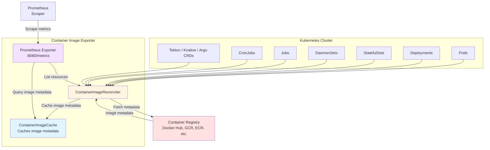
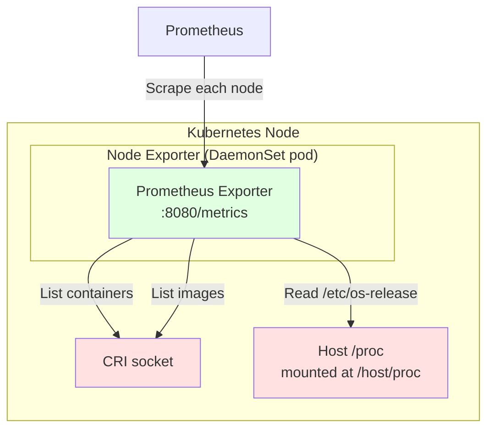

# container-image-exporter

> [!WARNING]
> This project is in the early stages of development and may not be suitable
> for production usage. Maintenance is provided on a best-effort basis.

Exports Prometheus metrics about container images in a Kubernetes cluster.

Particularly useful for tracking usage and adoption of Chainguard images across
a cluster based on image or container metadata.

## Components

The project consists of two components, each of which can be deployed
independently or together.

### Exporter

A cluster-wide Deployment that watches Kubernetes resources and fetches image
metadata from remote registries.

Doesn't require host-level access to containers.



### Node Exporter

A DaemonSet that runs on each node and exports per-container OS release
information plus per-image OCI labels and creation timestamps, all sourced
locally from the CRI runtime.

The most reliable method for inferring whether a running container is
Chainguard-based, but it does need to be ran as root on the host.



## Installation

Build and push the image:

```
export IMAGE_REF=your.registry/container-image-exporter:latest
docker build -t "${IMAGE_REF}" --push .
```

Install using the Helm chart, providing your image repository and tag:

```
helm install container-image-exporter ./deploy/chart \
    --namespace container-image-exporter \
    --create-namespace \
    --set image.repository=your.registry/container-image-exporter \
    --set image.tag=latest
```

Both components are enabled by default. To deploy only one of them:

```
# Disable the node-exporter Daemonset
--set nodeExporter.enabled=false

# Or, disable the exporter Deployment
--set exporter.enabled=false
```

See [Credentials](./docs/exporter.md#credentials) for instructions on how to
configure registry credentials for the exporter component.

If you are using the Prometheus Operator, enable the ServiceMonitors:

```
--set exporter.serviceMonitor.enabled=true \
--set nodeExporter.serviceMonitor.enabled=true
```

If you are using Grafana (via kube-prometheus-stack), enable automatic dashboard provisioning:

```
--set grafana.dashboards.enabled=true
```

Without the Prometheus Operator, both Services are annotated by default for
common Prometheus auto-discovery:

```yaml
prometheus.io/scrape: "true"
prometheus.io/port: "8080"
prometheus.io/path: "/metrics"
```

## Documentation

Refer to the per-component documentation for information about the provided
metrics, configuration and example queries.

- [Exporter](./docs/exporter.md) — the cluster-level Deployment 
- [Node Exporter](./docs/node-exporter.md) — the per-node DaemonSet.

## Dashboards

See [dashboards](./deploy/chart/dashboards) for examples of Grafana dashboards
that consume the exporter's metrics.


## Development

### Running the tests

The tests use [envtest](https://pkg.go.dev/sigs.k8s.io/controller-runtime/pkg/envtest)
to run a real Kubernetes API server and etcd in-process, and an in-process
container registry to push and pull images against. You do not need a running
Kubernetes cluster.

The `make test` target installs the required binaries via
[setup-envtest](https://pkg.go.dev/sigs.k8s.io/controller-runtime/tools/envtest/cmd/setup-envtest)
and then runs the suite.

```
make test
```

The binaries are cached in `./bin/` and only downloaded once. To install them
without running tests:

```
make envtest
```

### Node integration tests

The node exporter has an additional integration test suite (build tag
`nodeintegration`) that runs against a real CRI socket. The `make test-node`
target is self-contained: it installs [k3d](https://k3d.io) into `./bin/`,
creates a temporary cluster, deploys a workload, compiles and runs the test
binary inside the cluster node, then tears everything down.

```
make test-node
```

## Demo

The `make demo` target creates a self-contained cluster that demonstrates the
exporters running. 

### Prerequisites

- [Helm](https://helm.sh)
- [Docker](https://docs.docker.com/get-docker/)
- [chainctl](https://edu.chainguard.dev/chainguard/administration/how-to-install-chainctl/) — logged in to your Chainguard organisation
- These Helm charts in your Chainguard organization:
  - `cert-manager` (`oci://cgr.dev/<org>/charts/cert-manager`)
  - `kube-prometheus-stack` (`oci://cgr.dev/<org>/charts/kube-prometheus-stack`)

### Running

```
make demo ORG=<org-name>
```

Once deployed, the script prints port-forward commands and credentials for
Prometheus and Grafana. Open the Grafana dashboards to see the
container-image-exporter metrics visualised in real time.

To stop the demo and clean up the cluster, press Ctrl+C.
