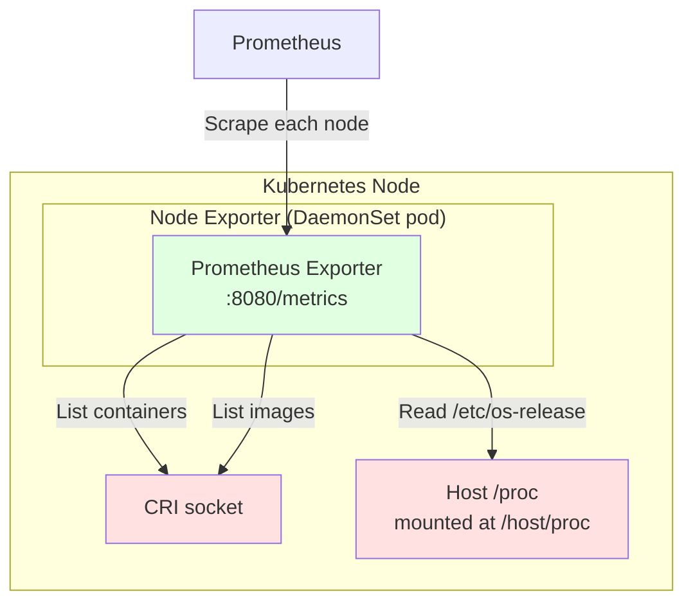

# Node Exporter

A DaemonSet that runs on each node and exports per-container OS release
information plus per-image OCI labels and creation timestamps, all sourced
locally from the CRI runtime.

The most reliable method for inferring whether a running container is
Chainguard-based, but it does need to be ran as root on the host.



## Installation

Build and push the image:

```
make docker DOCKER_IMAGE=your.registry/container-image-exporter:latest
docker push your.registry/container-image-exporter:latest
```

To deploy only the node-exporter (with the cluster-wide cluster-exporter Deployment
disabled):

```
helm install container-image-exporter ./deploy/chart \
    --namespace container-image-exporter \
    --create-namespace \
    --set image.repository=your.registry/container-image-exporter \
    --set image.tag=latest \
    --set clusterExporter.enabled=false
```

If you are using the Prometheus Operator, enable the ServiceMonitor:

```
--set nodeExporter.serviceMonitor.enabled=true
```

If you are using Grafana (via kube-prometheus-stack), enable automatic
dashboard provisioning:

```
--set grafana.dashboards.enabled=true
```

See the [installation instructions](../README.md#installation) for
more details.

## Metrics

| Metric                               | Description                                                                                                      | Labels                                                                                                                                                                                                            |
| ------------------------------------ | ---------------------------------------------------------------------------------------------------------------- | ----------------------------------------------------------------------------------------------------------------------------------------------------------------------------------------------------------------- |
| container_image_node_container_info  | Information about running containers from the local CRI runtime, plus OS release details from `/etc/os-release`. | id, namespace, pod, container, image, image_id, os_build_id, os_id, os_id_like, os_image_id, os_image_version, os_name, os_pretty_name, os_variant, os_variant_id, os_version, os_version_codename, os_version_id |
| container_image_node_image_labels    | Labels from the image config.                                                                                    | image_id, key, value                                                                                                                                                                                              |
| container_image_node_image_created   | The created date from the image config. Expressed as a Unix Epoch Time.                                          | image_id                                                                                                                                                                                                          |
| container_image_node_exporter_up     | 1 if the last collection completed successfully, 0 otherwise.                                                    | —                                                                                                                                                                                                                 |
| container_image_node_exporter_build_info | Always 1; labels carry the build version, git commit, and Go runtime version.                                | version, commit, goversion                                                                                                                                                                                        |

By default the `container_image_node_image_*` metrics only cover images
backing a running container. Install with `--set nodeExporter.onlyImagesInUse=false`
to report every image cached by the local CRI runtime.

## Example Queries

See the [Grafana dashboards](../deploy/chart/dashboards) for more complete
examples of how to consume the metrics.

### OS Distribution Breakdown Across Running Containers

Using the node exporter's `container_image_node_container_info` metric, you can
see which OS distributions are actually running across the cluster:

```
count by (os_id) (container_image_node_container_info)
```

This groups running containers by their `ID` from `/etc/os-release` (e.g.
`alpine`, `debian`, `wolfi`, `chainguard`), giving a real-time view of OS
distribution across nodes.

### Percentage of Containers Based on Chainguard

Because the node exporter reads `/etc/os-release` directly from each
container's root filesystem, you can identify Chainguard-based containers by
their `os_id` (`chainguard` or `wolfi`) without relying on labels being
propagated from the base image:

```
  100
*
    count(container_image_node_container_info{os_id=~"chainguard|wolfi"})
  /
    count(container_image_node_container_info)
```

Unlike the label-based query in the [cluster-exporter docs](./cluster-exporter.md#percentage-of-containers-based-on-chainguard),
this counts running containers on nodes rather than container specs, so
results are skewed by Deployments and DaemonSets that run many replicas.

### Images Older Than X Number of Days

Use `container_image_node_image_created` joined against
`container_image_node_container_info` to find running containers whose image
was created more than 14 days ago:

```
    time()
  -
    (
        (container_image_node_image_created >= 0)
      * on (image_id) group_right
        container_image_node_container_info
    )
>
  86400 * 14
```

The `>= 0` guard drops images that don't set a `created` timestamp, so they
aren't reported as being older than the epoch.

## Configuration

Configuration is expressed through the Helm chart's values. The examples below
use `--set` for brevity; the same keys can be set in a values file passed with
`-f`.

### CRI socket

Path to the CRI runtime socket on the host. Defaults to
`/run/containerd/containerd.sock`.

```
--set nodeExporter.criSocket=/run/crio/crio.sock
```

### proc root

The node exporter reads each container's `/etc/os-release` via
`/host/proc/{pid}/root`. If your cluster mounts the host `/proc` at a different
path, override it with:

```
--set nodeExporter.procRoot=/host/proc
```

### Only images in use

By default the node-exporter only reports `container_image_node_image_*`
metrics for images currently backing a running container on the node. To
report every image cached by the local CRI runtime (useful for tracking
disk usage from images that aren't currently in use):

```
--set nodeExporter.onlyImagesInUse=false
```

### Label allowlist

OCI image labels can carry arbitrary builder-controlled content (SBOMs,
multi-line descriptions, build IDs that change every build). To restrict
`container_image_node_image_labels` to a fixed set of keys:

```
--set 'nodeExporter.labelAllowlist[0]=org.opencontainers.image.title' \
--set 'nodeExporter.labelAllowlist[1]=org.opencontainers.image.vendor'
```

When unset (the default), every label on every reported image is emitted.
